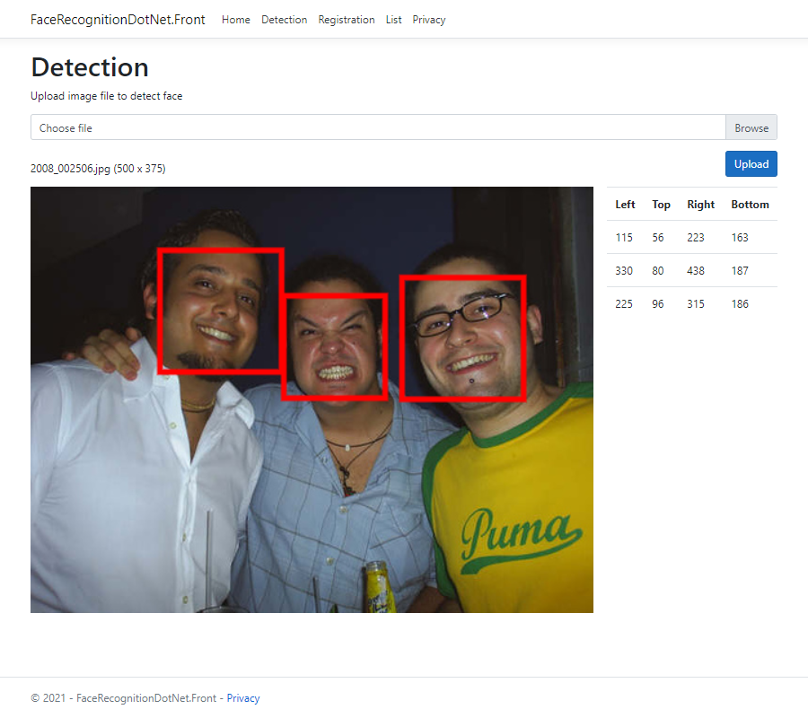
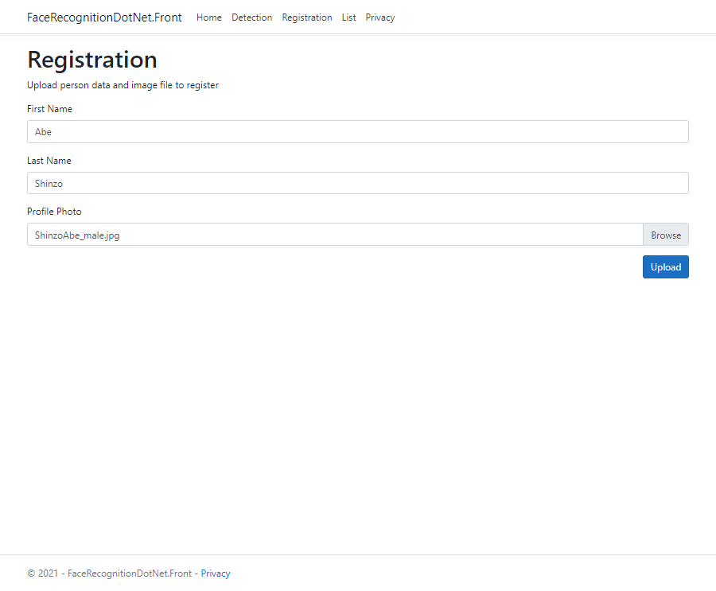

#  FaceRecognitionDotNet.Server 

ASP.NET Core Application provides APIs to detect and recognition face.

## Demo

#### Face Detection

#### Face Registration

#### Enumeration

## Dependencies Libraries and Products

#### [FaceRecognitionDotNet](https://github.com/takuya-takeuchi/FaceRecognitionDotNet/)

> **License:** The MIT License
>
> **Author:** Takuya Takeuchi
> 
> **Principal Use:** Simple APIs to detect and recognition face. This library is developed by this owner.