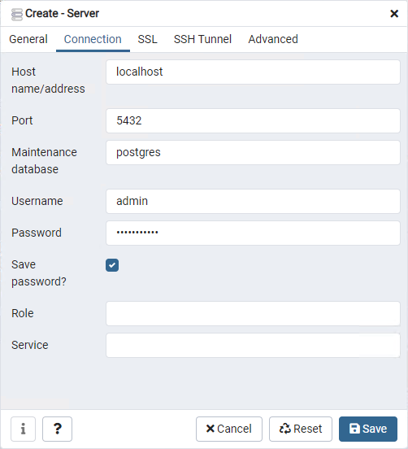

# PostgrSQL System


## How to run?

````shell
pwsh Run.ps1
````

## How to maintain database?

### Login

Launch web browser and access to http://localhost:58000
Enter root/p@ssword123


### Connect to database

Create server connection.
Enter the following text

* Host
  * localhost
* Port
  * 5432
* Username
  * admin
* Password
  * p@ssword123

